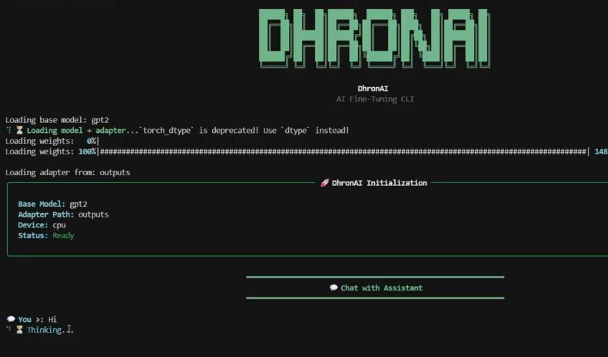

# DhronAI

A command-line tool for fine-tuning language models using LoRA and QLoRA.

---

## 🚀 Installation

### Basic Install

```bash
pip install dist/dhronai-0.1.0-py3-none-any.whl
CPU Support
pip install "dhronai[cpu]"
GPU Support (Recommended)
pip install "dhronai[gpu]"

GPU mode enables faster training and QLoRA (4-bit quantization).


## Demo



🧠 Features
CLI-based workflow using Typer + Rich
LoRA fine-tuning support
QLoRA (4-bit quantized training)
Hardware-aware model selection
Dataset preprocessing and validation
Modular and extensible pipeline
📦 Usage
🔹 Preprocess Dataset
dhronai preprocess preprocess \
  --input-path path/to/raw_data.json \
  --output-path data/processed/clean.jsonl
🔹 Train Model (LoRA)
dhronai train \
  --data data/processed/clean.jsonl
🔹 Train with QLoRA (4-bit)
dhronai train \
  --data data/processed/clean.jsonl \
  --qlora
🔹 Customize Training
dhronai train \
  --data data/processed/clean.jsonl \
  --epochs 2 \
  --batch-size 2 \
  --lr 2e-4
🔹 View All Commands
dhronai --help
dhronai train --help
dhronai preprocess --help
🤖 Supported Models
GPT-2 (124M)
DistilGPT-2 (82M)

OPT-125M available with limited compatibility.

⚙️ Notes
GPU recommended for QLoRA training
CPU mode works for smaller models
Dataset must be preprocessed before training
📁 Output

Training outputs include:

Adapter weights
Tokenizer files
Training artifacts

Saved in:

outputs/
🧪 Example Workflow
# Step 1: Preprocess
dhronai preprocess preprocess \
  --input-path raw.json \
  --output-path clean.jsonl

# Step 2: Train
dhronai train --data clean.jsonl --qlora
🏁 Summary

DhronAI provides an end-to-end CLI pipeline for:

Data preprocessing
Model selection
Efficient fine-tuning (LoRA / QLoRA)
Local execution

Designed for simplicity, extensibility, and real-world usability.